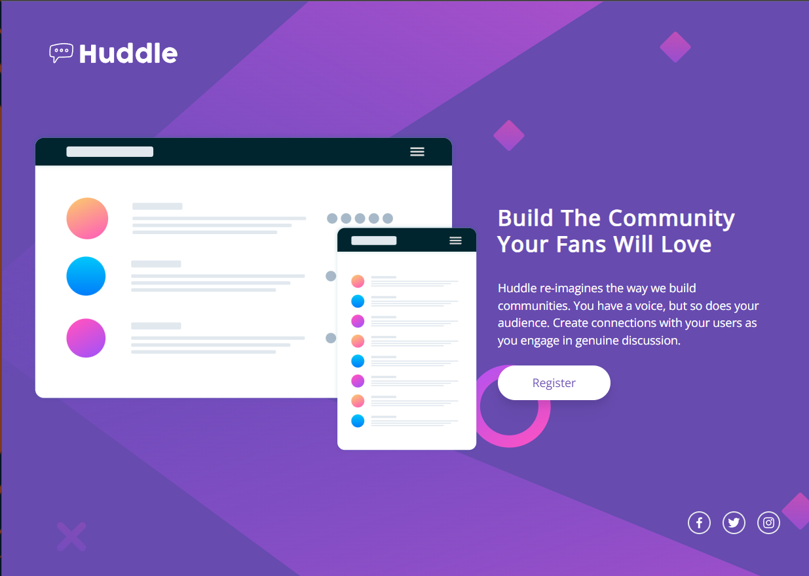

# Frontend Mentor - Huddle landing page with single introductory section solution

This is a solution to the [Huddle landing page with single introductory section challenge on Frontend Mentor](https://www.frontendmentor.io/challenges/huddle-landing-page-with-a-single-introductory-section-B_2Wvxgi0). Frontend Mentor challenges help you improve your coding skills by building realistic projects.

## Table of contents

- [Overview](#overview)
  - [The challenge](#the-challenge)
  - [Screenshot](#screenshot)
  - [Links](#links)
- [My process](#my-process)
  - [Built with](#built-with)
  - [What I learned](#what-i-learned)
  - [Continued development](#continued-development)
- [Author](#author)

## Overview

### The challenge

Users should be able to:

- View the optimal layout for the page depending on their device's screen size
- See hover states for all interactive elements on the page

### Screenshots

### Links

- Solution URL: [Add solution URL here](https://your-solution-url.com)
- Live Site URL: [Add live site URL here](https://your-live-site-url.com)

## My process

### Built with

- [React](https://reactjs.org/) - JS library
- [Next.js](https://nextjs.org/) - React framework
- [Tailwind CSS](https://tailwindcss.com/) - For styles

### What I learned

I learned a lot about layouts and using flexbos in various contexts to achieve a responsive design. Also, I learned how to place backgrounds in Tailwind.

### Continued development

I want to continue using flexboxes and grid layouts to achieve the desired design within Tailwind.

## Author

- Website - [Austin Johnson](https://www.austinjohnson.me)
- Frontend Mentor - [@AgenticAI](https://www.frontendmentor.io/profile/AgenticAI)
- Twitter - [@AustonianAI](https://www.twitter.com/AustonianAI)
- Github - [@AustonianAI](https://www.github.com/AustonianAI)
